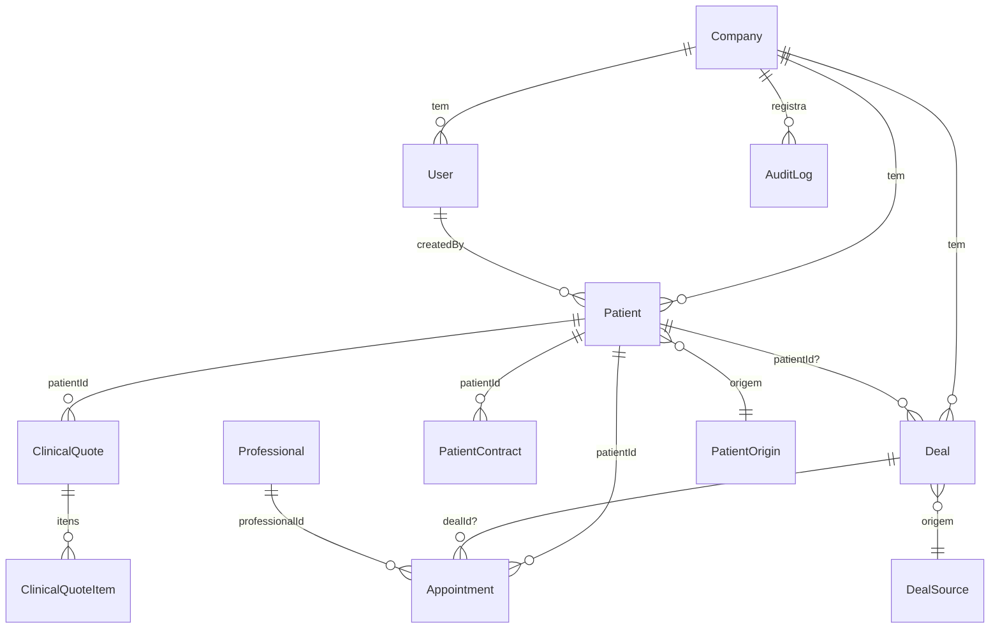
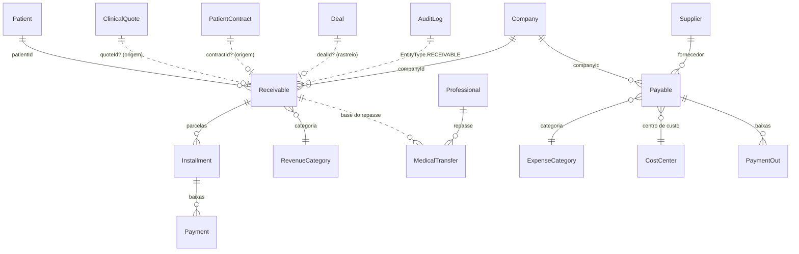

# AUDITORIA — MÓDULO FINANCEIRO (FASE 0)

> **Entrega exclusiva de auditoria.** Nenhuma migration, tabela, API, componente
> ou refatoração foi criada. Documento de análise para aprovação antes da Fase 1.
>
> Data: 2026-06-18 · Base auditada: `apps/web` (Next.js + Prisma + Supabase/Postgres).
> Schema: `apps/web/prisma/schema.prisma` (12 migrations aplicadas, última `20260618000000_add_telemedicine`).

---

## 0. Sumário executivo (achados críticos)

| # | Achado | Impacto na Fase 1 |
|---|--------|-------------------|
| A1 | **Não existe NENHUMA estrutura financeira** (sem Payment/Receivable/Payable/Installment/Transfer). Campo verde — sem dívida prévia a migrar. | Construção do zero, sobre base aditiva. |
| A2 | **`Pedido`/`Order` NÃO existe** (sem modelo, API ou página). A cadeia do enunciado `…→Orçamento→Pedido→Receita` tem um elo inexistente. | **Decisão de arquitetura obrigatória** (ver §7 e §Decisões). |
| A3 | **`Fornecedor`/`Supplier` e `Hub de Saúde` NÃO existem** no código (apesar de citados como módulos). Contas a Pagar (Fase 2) não tem entidade de fornecedor para referenciar. | Criar `Supplier` mínimo na Fase 2 (não há o que reaproveitar). |
| A4 | **Todos os valores monetários atuais usam `Float`** (`ClinicalQuote.total/subtotal/discount`, `ClinicalQuoteItem`, `PatientContract.value`, `Deal.valueEstimated`). Float causa erro de arredondamento em dinheiro. | Tabelas financeiras **devem usar `Decimal`**; não alterar colunas Float existentes (regressão). |
| A5 | **Não há RLS no Postgres.** Isolamento multiempresa é 100% camada de aplicação (`companyId` em todo `where`). Dívida já reconhecida (auditoria de resiliência 3/10). | Dado financeiro é sensível: enforcement rígido obrigatório + recomendação de RLS. |
| A6 | Infra de **auditoria, RBAC, controle modular SaaS e transações já existe e é madura** — o financeiro encaixa sem refatorar. | Reuso máximo; baixo risco de regressão. |

---

## 1. Inventário — Banco de Dados

### 1.1 Tabelas existentes (38 modelos)

**Núcleo / Multiempresa / Auth**
- `companies` (Company) — clínica assinante. Tem `plan`, `status`, `asaasCustomerId/asaasSubscriptionId` (cobrança **da assinatura SaaS**, não do paciente).
- `users` (User) — `role` (enum c/ **`FINANCE`**), `permissions` (Json por módulo), `companyId`.
- `audit_logs` (AuditLog) — `action`/`entityType` (enums), `oldValues`/`newValues` (Json), `ipAddress`, `userAgent`, `userId`, `companyId`.

**Pacientes / Clínico**
- `patients` (Patient) — `origin` (PatientOrigin), `@@unique([companyId, cpf])`.
- `timeline_events`, `patient_attachments`, `tags`, `patient_tags`.
- `clinical_quotes` (ClinicalQuote) + `clinical_quote_items` — **Orçamento clínico** (`subtotal/discount/total` Float, `status`: DRAFT/SENT/APPROVED/REJECTED, `patientId`).
- `patient_contracts` (PatientContract) — `value` Float, `status`: DRAFT/SENT/SIGNED/CANCELED.
- `medical_records`(+attachments), `anamnesis_*`, `contract_templates`, `patient_images`, `patient_documents`.

**CRM / Comercial**
- `deals` (Deal) — `valueEstimated` Float, `source` (DealSource: WEBSITE/REFERRAL/PHONE/WHATSAPP/SOCIAL_MEDIA/WALK_IN/EMAIL/OTHER), `patientId?`, `wonAt/lostAt`, `responsibleUserId`. **Fonte de "receita por origem".**
- `pipelines`, `pipeline_stages`, `deal_loss_reasons`, `deal_activities`.

**Agenda**
- `appointments` (Appointment) — `professionalId`, `patientId`, `status`, `modality`, `dealId?`.
- `professionals` (Professional) — **entidade-alvo do repasse médico** (separada de `User`; tem `crm`).
- `specialties`, `rooms`, `appointment_types`, `professional_schedules`, `schedule_blocks`, `appointment_status_history`, `appointment_reminders`, `professional_specialties`.

**Follow-up / Automação / WhatsApp / Notificação**
- `follow_up_templates`, `follow_up_tasks`, `automation_rules/triggers/actions/executions`, `notification_events`, `notification_settings`, `whatsapp_conversations/messages/quick_replies`.

**Controle SaaS Modular**
- `modules` (Module: `key`, `isCore`, `available`), `company_modules` (CompanyModule: `companyId`,`moduleKey`,`enabled`), `plan_features` (PlanFeature: `plan`,`moduleKey`).

**Telemedicina** (8 tabelas) — `telemedicine_sessions`, `_rooms`, `_participants`, `_consents`, `_chat`, `_attachments`, `_audit_logs`.

### 1.2 Views, Functions, Triggers
- **Nenhuma view, function ou trigger SQL.** Toda lógica vive na aplicação (Prisma). Migrations são puramente DDL de tabelas/índices/constraints. Sem `updatedAt` por trigger — o Prisma faz via `@updatedAt`.

### 1.3 Constraints / FKs / Índices — padrão observado
- **PK** `cuid()` em todo modelo (`String @id`).
- **FK por `@relation`** apenas **dentro do mesmo módulo** (ex.: `ClinicalQuote`→`ClinicalQuoteItem`, `TelemedicineSession`→filhos, com `onDelete: Cascade`).
- **FK "escalar" (sem `@relation`)** **cruzando módulos**: `companyId`, `patientId`, `professionalId`, `dealId`, `appointmentId` são `String` simples, resolvidos manualmente em código (padrão Deal/Appointment). **Este é o padrão oficial e o financeiro deve segui-lo** (ver `DIRETRIZES_ARQUITETURA_MODULAR.md`).
- **Unicidade multiempresa**: `@@unique([companyId, <campo>])` (ex.: `patients`, `tags`, `specialties`).
- **Índices**: presentes onde há consulta quente (ex.: `telemedicine_sessions @@index([companyId, status])`, `([companyId, scheduledAt])`). Demais modelos confiam no índice implícito de FK/unique.
- **Soft-delete** universal: `deletedAt DateTime?` + `where: { deletedAt: null }`.

### 1.4 RLS
- **Inexistente.** Nenhuma migration tem `ENABLE ROW LEVEL SECURITY`/`CREATE POLICY`. Isolamento depende exclusivamente do `where: { companyId }` da aplicação. (Dívida conhecida — `DIRETRIZES_ARQUITETURA_MODULAR.md` §"Bloqueios", item 4.)

---

## 2. Inventário — Backend

**Padrão de rota** (App Router, `src/app/api/**/route.ts`):
1. `resolveModuleUser('<modulo>')` ou `resolveClinicalUser(area, level)` → resolve usuário do banco + `companyId`, aplica `subscriptionBlock` (403 se clínica SUSPENDED/CANCELED) e `requireModuleEnabled` (controle SaaS).
2. RBAC: `requireRole` / `requirePermission(user, module, level)` / matriz por área (`clinical-access.ts`).
3. Query Prisma **sempre** com `where: { companyId: dbUser.companyId, deletedAt: null }`.
4. Escrita sensível → `writeAudit({ dbUser, action, entityType, entityId, oldValues, newValues, request })`.

**Helpers reutilizáveis (`src/lib/api/`)**: `session.ts` (`resolveDbUser`/`resolveModuleUser`, `ADMIN_ROLES`/`STAFF_ROLES`, `requireRole`, `requireSuperAdmin`), `permissions.ts` (`MODULES`, `effectivePermissions`, `hasPermission`, `requirePermission`, `sanitizePermissions`), `modules.ts` (entitlement SaaS), `clinical-access.ts` (matriz papel×área), `audit.ts` (`writeAudit`), `ownership.ts`, `patient-access.ts`.

**Transações**: `prisma.$transaction` já usado em `admin/companies`, `clinico/quotes/[id]`, `anamnese-templates/[id]`, `anamneses/[id]`. **Precedente estabelecido** para as operações atômicas exigidas (gerar parcelas, baixa, cancelamento, repasse).

**Validação**: Zod em `src/lib/validations/*` (um arquivo por módulo: `crm.ts`, `clinical.ts`, `appointment.ts`, etc.). Inputs tipados (`Create*Input`/`Update*Input`).

**Auth**: Supabase SSR (`lib/auth/server.ts` → `getCurrentUser`). `User.id` = id do Supabase. Middleware faz auth-guard de rotas.

**APIs existentes relevantes ao financeiro**: `crm/deals` (won/lost, valor), `clinico/quotes`, `patients/[id]/quotes|contracts`, `dashboard/commercial`, `dashboard/executive`, `dashboard/kpis`, `reports` (`/api/reports`), `audit`.

---

## 3. Inventário — Frontend

- **Páginas (`src/app/`)**: `dashboard` (+ `executive/commercial/agenda/reception/followup/whatsapp`), `pacientes` **e** `patients` (duplicadas), `clinico` (`anamneses/contratos/imagens/orcamentos/prontuario`), `crm`, `agenda`, `telemedicina`, `whatsapp`, `followup`, `automacoes`, `relatorios`, `configuracoes`, `admin`, `audit`, `tele/[slug]` (portal público).
- **Componentes (`src/components/`)**: `ui` (shadcn — `Card*`/`Button`/`Input`/`Select`/`Dropdown` são os "god nodes"), `dashboard/*`, `crm`, `agenda`, `clinical`, `patients`, `forms`, `layout`, `shell` (`Sidebar` + `nav-config.ts`).
- **Menu**: `nav-config.ts` lista itens com `module:`; `Sidebar` oculta itens sem `view` no módulo. Adicionar "Financeiro" = 1 entrada aqui.
- **Sem página/componente financeiro** hoje.

---

## 4. Inventário — Módulos citados no enunciado vs. realidade

| Módulo citado | Existe de fato? | Entidade real |
|---|---|---|
| Leads | Parcial | **`Deal`** (CRM) cobre lead/negociação; **não há modelo `Lead`**. `Deal.source` = origem. |
| Pacientes | ✅ | `Patient` (`origin`). |
| Agenda | ✅ | `Appointment`, `Professional`. |
| WhatsApp | ✅ | `WhatsAppConversation/Message`. |
| Orçamentos | ✅ | `ClinicalQuote`(+items) — **no módulo Clínico**, vínculo ao paciente. |
| **Pedidos** | ❌ **NÃO existe** | — sem modelo/API/página. |
| **Fornecedores** | ❌ **NÃO existe** | — sem modelo/API/página. |
| **Hubs de Saúde** | ❌ **NÃO existe** | — sem modelo/API/página. |
| Configurações / RBAC / Multiempresa | ✅ | `User.permissions`, `MODULES`, `Company`. |

> **Consequência:** a regra de não-duplicação **se aplica a `patient`, `quote`, `deal`, `professional`, `company`** (reaproveitar). Mas **`Pedido` e `Fornecedor` não existem** — não há duplicação a evitar; se forem necessários, são criação genuína (ver Decisões).

---

## 5. Relacionamentos existentes (mapa atual)

**Vínculos escalares (sem @relation) já existentes**: `Deal.patientId`, `Appointment.{patientId,professionalId,dealId}`, `ClinicalQuote.patientId`, `PatientContract.patientId`. Toda a rastreabilidade desejada **já tem ancoragem** até o Orçamento/Contrato. O elo que falta é Orçamento/Contrato → **Receita**.

---

## 6. Relatório obrigatório — respostas

**1) Quais tabelas podem ser reaproveitadas?**
`Patient`, `Company`, `User` (role `FINANCE`), `Deal` (`source`/`valueEstimated`/`wonAt`), `ClinicalQuote`(+items), `PatientContract`, `Appointment`, `Professional`, `AuditLog`, e o trio modular `Module/CompanyModule/PlanFeature`. Reaproveitamento por **FK escalar** (`patientId`, `companyId`, `quoteId`, `professionalId`, `dealId`).

**2) Quais tabelas NÃO devem ser alteradas?**
Nenhuma tabela existente precisa de alteração de coluna. **Não alterar `Float`→`Decimal` em tabelas existentes** (regressão de dados/serialização). As **únicas mudanças aditivas seguras** são: novos valores nos enums `EntityType` e `ActionType` (`ALTER TYPE ADD VALUE`, idempotente/aditivo) para auditar entidades financeiras — exatamente como Telemedicina fez.

**3) Quais relacionamentos já existem?** Ver §5. Cadeia Lead(`Deal`)→Paciente→Orçamento/Contrato já conectada.

**4) Quais relacionamentos precisam ser criados?**
`Receivable.patientId` (obrigatório), `Receivable.quoteId?`/`contractId?`/`dealId?` (origem/rastreabilidade), `Installment.receivableId`, `Payment.installmentId`, `Payable.supplierId?`/`costCenterId?`/`categoryId?`, `MedicalTransfer.professionalId`+`receivableId/paymentId`. Todos **escalares + `companyId`**.

**5) Quais riscos existem?**
- **R1 (alto):** ausência de RLS → vazamento entre clínicas se um `where companyId` for esquecido em rota financeira. Mitigação: helper `resolveFinanceUser` obrigatório + revisão + (recomendado) RLS.
- **R2 (alto):** `Float` para dinheiro → centavos errados em somas/parcelas. Mitigação: `Decimal` nas tabelas novas.
- **R3 (médio):** duplicidade de receita por mesmo Orçamento/Pedido. Mitigação: `@@unique` na origem (ver §7).
- **R4 (médio):** estados inconsistentes em geração de parcelas/baixa. Mitigação: `$transaction` (já é padrão).
- **R5 (baixo):** enum migration travar deploy se feita errada. Mitigação: só `ADD VALUE` aditivo.

**6) Quais pontos podem gerar regressão?**
Alterar enums in-place de forma destrutiva; tocar em `ClinicalQuote`/`Deal` existentes; adicionar `@relation` cruzando módulos (quebraria o padrão escalar e cascatas). **Plano: zero alteração nos modelos vivos; só adição.**

**7) Como evitar duplicidade de dados?**
Não recriar `patient/quote/deal/professional`. Receita referencia a origem por FK escalar. **Constraint anti-duplicação**: `@@unique([quoteId])` (ou `[orderId]`) parcial em `Receivable` para garantir "1 origem → 1 receita". Categorias/centros de custo em tabela própria por `companyId` (sem hardcode).

**8) Como evitar dívida técnica?**
`Decimal` para dinheiro desde o início; um `validations/financial.ts` (Zod); helper único de acesso; máquina de status explícita; auditoria em toda escrita; índices em `(companyId, status)` e `(companyId, dueDate)`; **resolver as páginas duplicadas `pacientes/`+`patients/` e `api.backup/` NÃO é tarefa deste módulo** (apenas registrado).

**9) Como manter compatibilidade total?**
Tudo aditivo: novos modelos + novos valores de enum + nova `moduleKey 'financeiro'` no catálogo + 1 item de `nav-config`. Sem migration destrutiva, sem refatorar rota existente. Backward-compat do controle modular: sem config, módulo nasce habilitado.

**10) Qual arquitetura financeira recomenda?** Ver §7 e §8.

---

## 7. Arquitetura financeira recomendada (proposta — para aprovação)

**Princípio:** o financeiro é uma **camada de liquidação** sobre as entidades comerciais/clínicas existentes. Ele **não** recria paciente/orçamento; **referencia** a origem e gera Receita → Parcelas → Pagamentos.

### Diagrama proposto

### Modelos novos previstos (todos `companyId` + `deletedAt` + `Decimal` no dinheiro)
- **Contas a Receber (Fase 1):** `Receivable` (origem: `patientId`, `quoteId?`/`contractId?`/`dealId?`, `categoryId`, `originalAmount`, `discount`, `finalAmount`, `status`, `notes`), `Installment` (`receivableId`, `number`, `dueDate`, `amount`, `status`), `Payment` (`installmentId`, `paidAt`, `amount`, `method`).
- **Contas a Pagar (Fase 2):** `Supplier` (mínimo), `Payable`, `PaymentOut`.
- **Catálogos (Fase 3/4):** `RevenueCategory`, `ExpenseCategory`, `CostCenter` — seed default + customização por `companyId`.
- **Repasse (Fase 8):** `MedicalTransfer` (`professionalId`, base em `Receivable`/`Payment`, regra percentual/fixo/híbrido).
- **Status como enums** (`ReceivableStatus`: PENDENTE/PARCIAL/PAGO/VENCIDO/CANCELADO; `PayableStatus`).
- **Fluxo de caixa / Dashboard / DRE (Fases 5/6/11):** **camada de leitura/agregação** (queries), sem novas tabelas — ou `materialized view` apenas se performance exigir (decisão posterior).
- **Inteligência comercial (Fase 7):** consultas sobre `Deal.source`/`Patient.origin` + `Receivable` + `Professional` — **sem novas entidades**.

### Reuso de infra (zero novo)
RBAC `FINANCE` + matriz `financial-access.ts` (espelho de `clinical-access.ts`) · `writeAudit` (+ enums `RECEIVABLE/INSTALLMENT/PAYMENT/PAYABLE/TRANSFER` em `EntityType`) · `$transaction` · `resolveModuleUser('financeiro')` · `MODULES`+`nav-config` · Zod em `validations/financial.ts`.

---

## 8. Decisões — RESOLVIDAS (2026-06-18)

1. **Elo "Pedido" (A2): ✅ SEM `Pedido`.** A Receita nasce de **Orçamento aprovado (`ClinicalQuote` APPROVED)** e/ou **Contrato assinado (`PatientContract` SIGNED)**. `Receivable` referencia `quoteId?`/`contractId?`/`dealId?`. Constraint anti-duplicação por origem.
2. **`Decimal` vs `Float` (A4): ✅ `Decimal`** em todas as tabelas financeiras novas; `Float` existentes **mantidos intactos** (inconsistência documentada e aceita).
3. **RLS (A5): ✅ APLICAR RLS** no Postgres para as tabelas financeiras já nesta entrega.
   > **Atenção de implementação (Fase 1):** o app conecta via Prisma. RLS só protege se o **role da conexão estiver sujeito às policies** (o service role do Supabase normalmente **bypassa** RLS). Será preciso: (a) policies `USING (company_id = current_setting(...))` + `SET app.company_id` por request/transação, **ou** (b) role dedicado não-bypass. A definir no início da Fase 1 — não muda o desenho das tabelas.
4. **Receita por origem (Fase 7): ✅ AMBOS com precedência** — `Deal.source` quando houver Deal vinculado; senão `Patient.origin` (fallback).
5. **Cobrança real: ✅ FORA de escopo** — PIX/boleto/NFS-e/Asaas-paciente excluídos (Asaas existente = só assinatura SaaS da clínica).

---

## 9. PARADA OBRIGATÓRIA

Conforme a regra crítica do projeto: **a Fase 0 termina aqui.** Nada foi implementado.
Aguardando **aprovação explícita** das decisões da §8 para iniciar a **Fase 1 — Contas a Receber**
(que será entregue no formato: Análise · Arquitetura · Impactos · Riscos · Implementação · Testes · Relatório Final).
